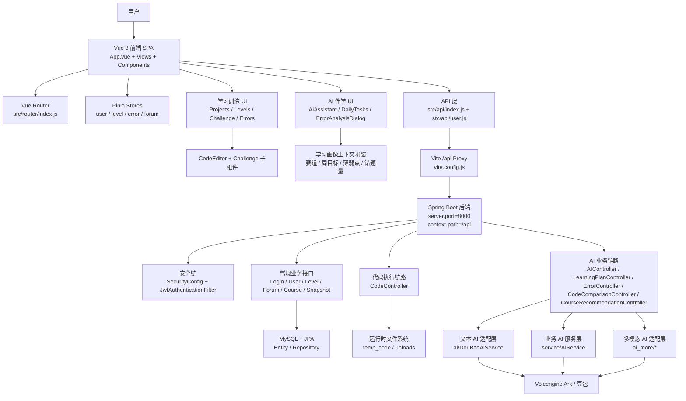

# AlgoMind 架构检阅报告

> 基于当前*工作区静态审阅整理。*目录树已主动忽略 `node_modules`、`dist`、`target`、图片等静态资源与编译产物，只保留核心源码、配置与运行链路。

## 第一步：全局扫描与理解摘要

### 1. 整体技术栈理解

- 前端是一个基于 `Vue 3 + Vite + Pinia + Vue Router + Element Plus` 的单页应用，辅以 `Monaco Editor` 承载代码输入、`GSAP` 承载视觉动效、`fetch + SSE` 承载 AI 流式回复。
- 后端是一个基于 `Spring Boot 3.5 + Spring Web + Spring Security + Spring Data JPA + MySQL` 的 REST 服务，统一挂载在 `/api` 上下文路径下，并用 JWT 做无状态认证。
- AI 能力并不是孤立的“聊天功能”，而是嵌入到学习计划、闯关评测、错题分析、代码对比、课程推荐、多模态问答等主业务流程中的“增强层”。
- 当前仓库中未发现 Ollama 对接代码；实际接入的模型供应方是火山引擎 Ark / 豆包，核心配置位于 `demo/src/main/resources/application.yaml`。

### 2. 对前后端分离架构的评估

- 物理分层是清晰的：根目录 `src/` 为前端 SPA，`demo/` 为独立 Spring Boot 后端，`vite.config.js` 通过代理把前端 `/api` 请求转发到 `http://localhost:8000`。
- 接口边界总体明确：前端通过 `src/api/index.js` 与 `src/api/user.js` 访问后端接口，后端通过 Controller 暴露 REST API，再落到 Service / Repository / Entity。
- 但逻辑分层仍有模糊点：
  - 前端 `AIAssistant.vue` 与 `Challenge.vue` 同时承担 UI、状态编排、接口调用、错误降级、上下文拼装等职责，页面层偏“胖”。
  - 后端 `LearningPlanController.java`、`ErrorController.java` 也存在 Controller 内聚合业务规则、AI 降级策略、数据组装逻辑的情况，表现为“控制器过重”。

### 3. AI 智能功能与常规 Web 业务逻辑的融合方式

- 伴学交互：`src/components/AIAssistant.vue` 会读取当前赛道、周目标、薄弱点、累计错题、坚持指数等学习画像，拼装成聊天上下文，再通过 `/api/ai/chat/stream` 或多模态接口进行流式对话。
- 学习计划：前端调用 `/api/learning-plans/current` 与 `/api/learning-plans/generate`；后端优先走 AI 生成，失败后降级到本地算法生成个性化计划。
- 代码推演/评测：`src/views/Challenge.vue` 把代码编辑、运行、AI 评测、历史快照、最佳解对比整合到一个作答流程里，分别对应 `/api/run-code`、`/api/ai/evaluate-code(/stream)`、`/api/code-snapshots`、`/api/code-comparison`。
- 错题闭环：答题错误会被 `LevelSubmissionService` 写入错题本；前端错题页再通过 `/api/error-analysis` 发起 AI 分析，并结合题库推荐或 AI 兜底练习生成“复盘 + 练习”闭环。

### 4. 一句话结论

- AlgoMind 更像一个“以学习任务流为主、以 AI 作为增强引擎的算法训练平台”，而不是一个简单外挂 AI 聊天框的普通题库站点。

## 一、目录树结构（Tree View）

```text
algo-mind/
├─ src/
│  ├─ api/
│  │  ├─ index.js
│  │  ├─ requestOptions.js
│  │  └─ user.js
│  ├─ assets/
│  │  ├─ base.css
│  │  └─ main.css
│  ├─ components/
│  │  ├─ AIAssistant.vue
│  │  ├─ AppFooter.vue
│  │  ├─ AuthorLevelBadge.vue
│  │  ├─ AvatarPendant.vue
│  │  ├─ AvatarUpload.vue
│  │  ├─ CodeEditor.vue
│  │  ├─ CourseDetail.vue
│  │  ├─ CustomConfirmDialog.vue
│  │  ├─ CustomMessage.vue
│  │  ├─ DailyTasks.vue
│  │  ├─ ErrorAnalysisDialog.vue
│  │  ├─ FlowerPagination.vue
│  │  ├─ LevelCard.vue
│  │  ├─ SearchBar.vue
│  │  └─ challenge/
│  │     ├─ ChallengeAnswerPane.vue
│  │     ├─ ChallengeEvaluationPanel.vue
│  │     ├─ ChallengeTaskPanel.vue
│  │     └─ CodeComparisonPanel.vue
│  ├─ composables/
│  │  ├─ useConfirm.js
│  │  └─ useMessage.js
│  ├─ constants/
│  │  ├─ authorLevelThemes.js
│  │  └─ codeEditor.js
│  ├─ router/
│  │  └─ index.js
│  ├─ stores/
│  │  ├─ counter.js
│  │  ├─ error.js
│  │  ├─ forum.js
│  │  ├─ level.js
│  │  └─ user.js
│  ├─ utils/
│  │  └─ file.js
│  ├─ views/
│  │  ├─ Challenge.vue
│  │  ├─ CodeHistory.vue
│  │  ├─ Courses.vue
│  │  ├─ Errors.vue
│  │  ├─ Forum.vue
│  │  ├─ ForumPost.vue
│  │  ├─ Home.vue
│  │  ├─ Levels.vue
│  │  ├─ Login.vue
│  │  ├─ Profile.vue
│  │  ├─ Projects.vue
│  │  ├─ Ranking.vue
│  │  ├─ Register.vue
│  │  ├─ AboutView.vue
│  │  └─ HomeView.vue
│  ├─ App.vue
│  ├─ constants.js
│  └─ main.js
├─ demo/
│  ├─ pom.xml
│  └─ src/
│     └─ main/
│        ├─ java/com/example/demo/
│        │  ├─ ai/
│        │  ├─ ai_more/
│        │  ├─ auth/
│        │  ├─ author/
│        │  ├─ config/
│        │  ├─ controller/
│        │  ├─ dto/
│        │  ├─ entity/
│        │  ├─ repository/
│        │  ├─ service/
│        │  ├─ util/
│        │  ├─ DemoApplication.java
│        │  └─ Result.java
│        └─ resources/
│           └─ application.yaml
├─ package.json
├─ vite.config.js
├─ docker-compose.yml
├─ init.sql
└─ algomind_db.sql
```

## 二、核心模块与文件摘要

| 文件/目录路径                                                                              | 架构分层                    | 核心功能                                                                |
| ------------------------------------------------------------------------------------ | ----------------------- | ------------------------------------------------------------------- |
| `package.json`                                                                       | 前端工程配置                  | 定义 Vue 3、Pinia、Element Plus、Monaco、GSAP 等依赖。                        |
| `vite.config.js`                                                                     | 构建与代理层                  | 定义别名 `@`，并将前端 `/api` 请求代理到 `http://localhost:8000`。                 |
| `src/main.js`                                                                        | 前端启动层                   | 挂载 Vue 应用、Pinia、Element Plus 与 Router。                              |
| `src/App.vue`                                                                        | 应用壳层 / 全局 UI            | 承载全局顶栏、主题背景切换与整体页面骨架。                                               |
| `src/router/index.js`                                                                | 路由层 / 路由守卫              | 声明页面路由，并通过 `beforeEach` 以 `localStorage.user` 做前端鉴权门禁。              |
| `src/assets/main.css`                                                                | 全局样式系统 / 视觉基础设施         | 定义 `.surface-card`、`.glass-panel` 等毛玻璃亚克力风格基础样式，是全站玻璃拟态视觉的公共底座。     |
| `src/views/Login.vue`                                                                | 登录页 / 视觉核心              | 视觉核心：使用 `GSAP + canvas + requestAnimationFrame` 构建角色眼球跟随、眨眼和眼睑覆盖动画。 |
| `src/views/Levels.vue`                                                               | 关卡地图页 / 算法训练入口          | 视觉核心：用云朵、卡车、终点旗帜、像素地图组织赛道进度与关卡解锁状态。                                 |
| `src/views/Profile.vue`                                                              | 个人中心 / 视觉与用户域           | 视觉核心：封装大体量玻璃拟态弹窗、头像编辑、状态设置与学习画像展示。                                  |
| `src/views/Challenge.vue`                                                            | 挑战页 / 业务编排层             | 聚合作答、代码编辑、运行、AI 评测、快照保存、最佳解对比、AI 侧边栏等核心学习流程。                        |
| `src/views/Errors.vue`                                                               | 错题本页                    | 汇总错题、已完成错题，并驱动 AI 错题分析弹窗。                                           |
| `src/views/Courses.vue`                                                              | 课程页                     | 承载课程展示与课程推荐入口。                                                      |
| `src/views/Forum.vue`                                                                | 社区页                     | 社区帖子列表、搜索与交互入口。                                                     |
| `src/views/CodeHistory.vue`                                                          | 历史代码页                   | 展示历史快照、最佳解与代码成长轨迹。                                                  |
| `src/components/CodeEditor.vue`                                                      | UI 组件 / 代码输入            | 对 Monaco 做语言切换、模板填充和主题封装，是代码题的核心输入组件。                               |
| `src/components/AIAssistant.vue`                                                     | AI 伴学模块 / 前端 AI 核心      | AI 核心：整合学习计划、画像构建、上下文拼装、聊天历史、多模态上传与 SSE 对话。                         |
| `src/components/DailyTasks.vue`                                                      | 学习计划 UI                 | 呈现 AI 或本地生成的每日学习任务。                                                 |
| `src/components/ErrorAnalysisDialog.vue`                                             | AI 分析 UI                | 展示错题 AI 分析结果、知识点与建议。                                                |
| `src/components/SearchBar.vue`                                                       | 可复用 UI 组件 / 视觉核心        | 视觉核心：封装带模糊、半透明、下拉过滤的亚克力搜索条。                                         |
| `src/components/challenge/ChallengeTaskPanel.vue`                                    | Challenge 子模块           | 展示题目内容、题型与作答说明。                                                     |
| `src/components/challenge/ChallengeAnswerPane.vue`                                   | Challenge 子模块           | 承载答案输入区、语言切换和代码编辑区域。                                                |
| `src/components/challenge/ChallengeEvaluationPanel.vue`                              | Challenge 子模块           | 展示 AI 评测分数、星级、点评与反馈。                                                |
| `src/components/challenge/CodeComparisonPanel.vue`                                   | Challenge 子模块 / AI 分析视图 | 展示当前代码与历史最佳代码的 AI 对比结果。                                             |
| `src/stores/user.js`                                                                 | 全局状态管理                  | 管理登录用户、积分、赛道、头像与本地持久化。                                              |
| `src/stores/level.js`                                                                | 全局状态管理                  | 拉取关卡、按赛道分组、提交答案、同步解锁状态并缓存到本地。                                       |
| `src/stores/error.js`                                                                | 全局状态管理 / AI 分析缓存        | 管理错题、已完成错题、AI 分析缓存与错题完成状态。                                          |
| `src/stores/forum.js`                                                                | 全局状态管理                  | 管理社区帖子、点赞、删除与本地兜底缓存。                                                |
| `src/api/index.js`                                                                   | API 基础设施                | 创建 axios 实例、注入 JWT、统一处理 401/403/500 响应。                             |
| `src/api/user.js`                                                                    | API 服务层 / 前端 AI 通信核心    | AI 核心：集中封装学习计划、AI 聊天、流式评测、代码运行、快照、代码对比、多模态上传接口。                     |
| `src/utils/file.js`                                                                  | 工具层                     | 统一处理头像与上传文件 URL 归一化。                                                |
| `demo/pom.xml`                                                                       | 后端工程配置                  | 定义 Spring Boot、JPA、Security、JWT、Swagger、MySQL、火山引擎 Ark SDK 等依赖。     |
| `demo/src/main/resources/application.yaml`                                           | 后端配置 / 外部系统接入           | 配置服务端口、`/api` 上下文路径、JWT、MySQL、文件上传与豆包/Ark 模型参数。                     |
| `demo/src/main/java/com/example/demo/config/SecurityConfig.java`                     | 安全配置层                   | 配置无状态 JWT 安全链、匿名放行路径与过滤器装配。                                         |
| `demo/src/main/java/com/example/demo/auth/JwtAuthenticationFilter.java`              | 认证中间件                   | 从请求头解析 JWT 并回填 Spring Security 上下文。                                 |
| `demo/src/main/java/com/example/demo/auth/CurrentUserService.java`                   | 鉴权辅助层                   | 为业务控制器提供“当前登录用户”获取能力。                                               |
| `demo/src/main/java/com/example/demo/controller/LoginController.java`                | 认证接口层                   | 处理注册、登录与 Token 发放。                                                  |
| `demo/src/main/java/com/example/demo/controller/UserController.java`                 | 用户域接口层                  | 提供个人资料、热力图、积分、活动轨迹等用户统计接口。                                          |
| `demo/src/main/java/com/example/demo/controller/LevelController.java`                | 关卡接口层                   | 提供关卡列表和答题提交接口。                                                      |
| `demo/src/main/java/com/example/demo/service/LevelSubmissionService.java`            | 核心业务服务层                 | 处理答题判定、积分发放、下一关解锁、错题入库与作者等级刷新。                                      |
| `demo/src/main/java/com/example/demo/controller/CodeController.java`                 | 代码执行服务                  | 负责多语言代码编译运行，是代码题执行链路核心。                                             |
| `demo/src/main/java/com/example/demo/controller/AIController.java`                   | AI 接口层 / 文本对话与评测        | AI 核心：提供普通聊天、流式聊天、代码评测、流式评测，并接收前端学习画像上下文。                           |
| `demo/src/main/java/com/example/demo/ai/DouBaoAiService.java`                        | AI 基础设施 / 模型适配层         | AI 核心：封装对豆包/Ark 的同步与流式调用。                                           |
| `demo/src/main/java/com/example/demo/service/AIService.java`                         | AI 业务服务层                | 为学习计划、课程推荐、错题分析、代码比较等场景提供更业务化的 AI 调用入口。                             |
| `demo/src/main/java/com/example/demo/controller/LearningPlanController.java`         | 学习计划接口层                 | 负责获取当前学习计划、AI 生成计划、计划保存，以及本地算法降级生成。                                 |
| `demo/src/main/java/com/example/demo/controller/ErrorController.java`                | 错题本与 AI 分析接口层           | 负责错题 CRUD、完成状态、AI 分析、配额控制及题库推荐。                                     |
| `demo/src/main/java/com/example/demo/service/AiAnalysisQuotaService.java`            | AI 配额管理层                | 控制错题 AI 分析时段配额，避免无限制调用。                                             |
| `demo/src/main/java/com/example/demo/controller/CodeComparisonController.java`       | AI 分析接口层                | 对当前代码与历史代码做 AI 比较与建议输出。                                             |
| `demo/src/main/java/com/example/demo/controller/CodeSnapshotController.java`         | 代码历史接口层                 | 管理代码快照、最佳快照和统计信息。                                                   |
| `demo/src/main/java/com/example/demo/service/CodeSnapshotService.java`               | 代码历史业务层                 | 封装快照保存、最佳解筛选与成长统计。                                                  |
| `demo/src/main/java/com/example/demo/controller/CourseRecommendationController.java` | AI 推荐接口层                | 基于用户画像、错题与计划生成课程推荐。                                                 |
| `demo/src/main/java/com/example/demo/ai_more/ChatFileUploadController.java`          | 多模态上传接口层                | 提供聊天文件上传能力，是多模态 AI 输入前置步骤。                                          |
| `demo/src/main/java/com/example/demo/ai_more/DouBaoAiController.java`                | 多模态 AI 接口层              | 负责图片等多模态问答接口，与文本 AI 接口并行存在。                                         |
| `demo/src/main/java/com/example/demo/entity/`                                        | 数据模型层                   | 定义用户、关卡、错题、快照、课程、论坛等持久化实体。                                          |
| `demo/src/main/java/com/example/demo/repository/`                                    | 持久化访问层                  | 通过 JPA Repository 访问 MySQL 数据。                                      |
| `demo/src/main/java/com/example/demo/dto/ai/`                                        | 数据传输层                   | 定义学习计划、对话、代码比较、错题分析等 AI 场景 DTO。                                     |
| `docker-compose.yml`                                                                 | 部署编排配置                  | 为本地或部署环境提供容器化编排入口。                                                  |
| `init.sql` / `algomind_db.sql`                                                       | 数据初始化层                  | 提供数据库初始化与题库/业务数据落库基础。                                               |

## 三、架构设计与通信链路

### 1. 状态流转

- 全局状态以 Pinia 为主：
  - `userStore` 保存用户、积分、赛道、头像，并同步到 `localStorage`。
  - `levelStore` 保存赛道列表、关卡列表、解锁状态，并在提交答案后更新本地缓存。
  - `errorStore` 保存错题、已完成错题，并以用户维度缓存 AI 分析结果。
  - `forumStore` 保存社区帖子，并在后端异常时退回本地缓存。
- 页面级复杂状态没有完全收敛到 Store：
  - `Challenge.vue` 自己维护当前题目、语言、代码、执行结果、AI 评测、快照、对比结果、AI Dock 展开状态。
  - `AIAssistant.vue` 自己维护聊天消息、学习计划生成状态、上传文件、多模态上下文和流式渲染状态。
- 组件间共享方式以“父视图集中编排 + 子组件 props/emits” 为主，尤其体现在 `Challenge.vue` 与 `components/challenge/*` 之间。

### 2. 接口抽象

- 前端存在清晰的基础 API 封装层：
  - `src/api/index.js` 负责 axios 实例、JWT 注入、通用错误提示。
  - `src/api/user.js` 负责业务方法导出，并通过 `streamRequest()` 统一处理 SSE 流式返回。
- 通信方式分两类：
  - 常规 REST：登录、关卡、错题、快照、课程、论坛等都走 axios。
  - 流式 AI：AI 聊天与代码评测走 `fetch` + `ReadableStream`，前端逐段消费文本或 SSE `data:` 块。
- 后端接口边界也较清晰：
  - `SecurityConfig` 负责鉴权与匿名放行。
  - `Controller` 负责对外 API。
  - `Service` 负责业务逻辑与 AI 调用。
  - `Repository` 负责数据访问。
- 但 AI 抽象层尚未统一：
  - 文本聊天/评测主要经 `AIController + ai/DouBaoAiService`。
  - 学习计划/推荐/代码比较/错题分析又主要经 `AIService`。
  - 多模态接口则另有 `ai_more/*` 一套控制器与服务。
- 结论：前端有 API 封装层，后端也有服务层，但 AI 相关能力存在多入口并行，抽象边界还不够统一。

### 3. Mermaid 核心架构图



## 四、架构审查与自我修正

### 1. 耦合度审查

- 当前 UI 视图层与业务/AI 逻辑层耦合偏深，最典型的是：
  - `src/components/AIAssistant.vue` 同时承担“展示层 + 学习计划状态机 + 聊天上下文生成 + 多模态上传 + 流式渲染 + 错误处理”。
  - `src/views/Challenge.vue` 同时承担“题目编排 + 代码编辑 + 运行调用 + AI 评测 + 快照对比 + AI Dock 交互”。
- 优化建议：
  - 前端新增 `src/modules/ai/` 或 `src/services/ai/`，把 `useAiChat`、`useLearningPlan`、`useCodeEvaluation`、`useCodeComparison` 抽成 composable/service；
  - 后端新增统一 `AiGateway` / `AiProvider` 抽象，把 `AIService`、`ai/DouBaoAiService`、`ai_more/*` 的提供者接口收口；
  - 页面组件只负责视图与交互，真正的 AI 编排与降级策略下沉到模块层。

### 2. 反向验证与修正

- 已核对关键配置文件：`package.json`、`vite.config.js`、`demo/pom.xml`、`demo/src/main/resources/application.yaml`、`docker-compose.yml`、`init.sql`、`algomind_db.sql` 均存在，且都与主链路相关。
- 已核对前端路由守卫：项目没有单独的“路由守卫目录”，而是直接在 `src/router/index.js` 中通过 `router.beforeEach()` 做前端鉴权。
- 已核对全局状态仓库：主 Store 为 `user.js`、`level.js`、`error.js`、`forum.js`；`counter.js` 属于 Vue 模板遗留，不是 AlgoMind 核心状态仓库。
- 已核对后端鉴权链：`SecurityConfig.java`、`JwtAuthenticationFilter.java`、`CurrentUserService.java` 共同构成后端认证与当前用户解析主链路。
- 已修正 AI 提供方判断：仓库中没有发现 Ollama 适配器；当前实际模型链路指向豆包 / 火山引擎 Ark。
- 已修正视觉组件判断：未发现独立的 “Low Poly 动态背景” 组件；目前最突出的视觉封装实际是 `Login.vue` 的角色动画、`Levels.vue` 的地图动效，以及 `main.css` / `Profile.vue` / `SearchBar.vue` 的毛玻璃样式体系。
- 已核对 AI 文件边界：`ai/` 与 `ai_more/` 两套包并存，存在重复控制器与服务命名，说明 AI 接入历史上可能经历过分支演进或并行实验。
- 已发现配置风险：`application.yaml` 中存在生产样式的数据库地址、账号密码与 API Key 默认值，这类敏感配置不宜继续保留在仓库默认配置中，建议尽快迁移到环境变量或密钥管理系统。
- 已发现架构一致性风险：`LearningPlanController.java` 内含大量用户画像、计划生成、统计补全、降级逻辑，且部分统计值仍带有明显本地演示/占位特征，这会让 Controller 成为未来维护热点。

## 附：本次检阅的高优先级结论

- 前后端分离形态成立，但“页面过胖”和“控制器过胖”同时存在。
- AI 已深度嵌入 AlgoMind 主业务，不是外挂功能；因此 AI 层必须像支付层或认证层一样被正式模块化。
- 最值得优先重构的两个位置是 `src/components/AIAssistant.vue` 和 `demo/src/main/java/com/example/demo/controller/LearningPlanController.java`。
- 最值得优先治理的运维问题是 `demo/src/main/resources/application.yaml` 中的敏感默认配置。

